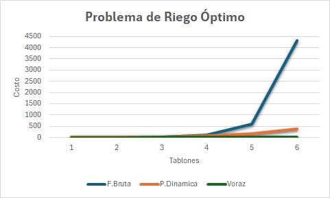
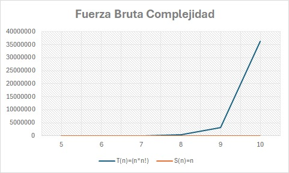
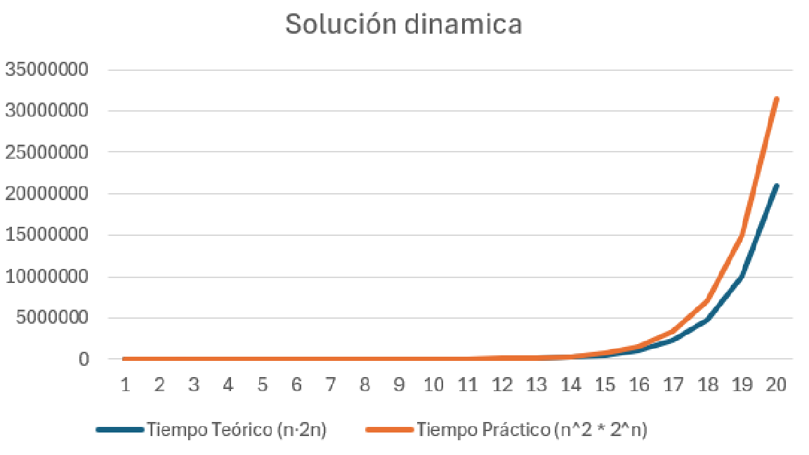

# Informe de Complejidad - Problema de Riego Óptimo

## 1. Fuerza Bruta

---

### Complejidad Temporal T(n)

Para un conjunto de ( n ) tablones:

1. Generar todas las permutaciones posibles de los índices $0, 1, 2, \dots, n-1$ tiene un costo de: $O(n!)$
2. **Evaluación del costo para cada permutación:**
    
    La función `compute_cost_for_permutation` recorre todos los tablones dos veces:
    
    - Una vez para calcular los tiempos de inicio $(O(n))$.
    - Otra vez para calcular el costo $(O(n))$.
    
    Por tanto, el costo de evaluar una permutación es:
    
    $$
    (O(n))
    $$
    
3. **Costo total del algoritmo:**

$$
O(n! \times n) = O(n \cdot n!)
$$

### Complejidad Espacial S(n)

- Cada permutación se genera y procesa una a la vez por `itertools.permutations`, lo que evita almacenar todas las permutaciones en memoria.
- Se usa memoria proporcional a:
    - La lista `finca` → (O(n))
    - La lista temporal `perm` → (O(n))
    - Variables auxiliares (enteros, listas temporales pequeñas)

Por tanto:

$$
S(n) = O(n)
$$

### Corrección del algoritmo

El método de fuerza bruta **garantiza la solución óptima**, ya que explora exhaustivamente **todas las posibles permutaciones** del orden de riego y selecciona la de menor costo.

Formalmente:

$$
\text{roFB}(F) = \arg\min_{\Pi \in S_n} CRF_{\Pi}
$$

donde $S_n$ es el conjunto de todas las permutaciones de $n$ elementos.

Por lo tanto, el algoritmo es **correcto y completo**, aunque **ineficiente para grandes valores de $n$**.

## 2. Programación Dinámica

---

## Complejidad Temporal T(n)

- $S$ tiene una cantidad $2^n$  de subconjuntos posibles dado por las `mask` .
- Para cada subconjunto se itera sobre los tablones activos.
- Para cada tablón se busca tomar su tiempo, donde en el peor caso puede haber varios pero el número total de estados `(mask)` crece proporcionalmente al número de combinaciones distintas.

Teniendo esto en cuenta, la complejidad T(n) de la solución dinámica es de:

$$
T(n) = O(n \cdot 2^n)
$$

## Complejidad Espacial S(n)

- En memoria se almacena un valor $DP[S]$ por cada conjunto $S$
- $DP$ guarda al menos un valor por cada combinación posible de `(mask, t)`

Por lo tanto, la complejidad espacial S(n) es de:

$$
S(n) = O(2^n)
$$

# 3. Algoritmo Voraz

---

## Complejidad Temporal T(n)

- El algoritmo inicia calculando una **razón de prioridad** `(pᵢ / tsᵢ)` para cada tablón, operación que se realiza una sola vez por elemento, en tiempo **O(n)**.
- Luego, utiliza la función `sorted()` de Python para **ordenar los tablones** según dicha razón.
El algoritmo de ordenamiento más eficiente empleado por Python (Timsort) tiene una complejidad temporal de **O(n log n)**.
- Finalmente, se realiza un recorrido lineal sobre todos los tablones para **calcular el costo total**, lo cual añade un costo adicional **O(n)**.

Sumando todos los pasos, la complejidad temporal del algoritmo voraz es:

$$
T(n) = O(n \log n)
$$

Esto significa que el algoritmo escala de manera eficiente, incluso para **instancias grandes**, manteniendo tiempos de ejecución muy bajos comparados con los métodos de fuerza bruta o programación dinámica.

## Complejidad Espacial S(n)

- El algoritmo utiliza una **lista de índices** de tamaño *n* para representar el orden de riego.
- No requiere estructuras adicionales de almacenamiento, ni matrices de estados o máscaras.
- Las variables empleadas (`tiempo_actual`, `costo_total`, `orden`) ocupan **espacio constante** adicional.

Por lo tanto, la complejidad espacial es lineal con respecto al número de tablones:

$$
S(n) = O(n)
$$

Esto hace que el algoritmo voraz sea **muy eficiente en uso de memoria**, apropiado para resolver problemas de gran escala con recursos limitados.

## 4. Resumen comparativo

En la siguiente sección se presenta una comparación entre las tres estrategias implementadas para resolver el Problema de Riego Óptimo:

- Fuerza Bruta (roFB)

- Programación Dinámica (roPD)

- Algoritmo Voraz (roV)

---

| Estrategia | Complejidad Temporal | Complejidad Espacial |
| ---------------------- | -------------------- | -------------------- |
| Fuerza Bruta | $O(n \cdot n!)$  | $O(n)$ |
| Programación Dinámica  | $O(n \cdot 2^n)$ | $O(2^n)$ |
| Voraz | $O(n \cdot log (n))$ | $O(n)$ |

---

### 4.1 Analisis mediante gráficas

La siguiente figura muestra el costo total obtenido por cada estrategia para un número creciente de tablones. Se hizo con valores pequeños debido a que el crecimiento exponcial no permite ver la diferencia entre las tres opciones.

Se observa que el costo de fuerza bruta obtiene se dispara, mientras que el algoritmo voraz y la programación dinámica logran valores cercanos con un costo computacional mucho menor.
A medida que el número de tablones crece, la diferencia en tiempo de ejecución se vuelve determinante.

La complejidad temporal de la fuerza bruta es factorial, $T(n)=O(n!⋅n)$, lo cual se refleja en el crecimiento abrupto del tiempo de ejecución. La complejidad espacial $S(n)=O(n)$ resulta lineal, ya que solo se almacenan estructuras proporcionales al número de tablones.

Comparacion teorica de complejidades en caso practico y teorico de PD.

En la solución dinámica, el tiempo crece aproximadamente de forma exponencial $O(n^2 \cdot 2^n)$, aunque mucho más lento que el crecimiento factorial de la fuerza bruta. Se aprecia que la curva práctica se aproxima bastante a la teórica, evidenciando la consistencia del análisis de complejidad.

## 5. Conclusiones

---

### Programación bruta:

La solución por fuerza bruta genera todas las permutaciones posibles, por lo tanto su complejidad temporal es
$O(n!⋅n)$.
Se verificó experimentalmente que el tiempo crece factorialmente: la ejecución es factible hasta $n=10$.
Para n mayores, el algoritmo resulta impracticable: por ejemplo, $n=100$ implicaría 9.3×10¹⁵⁷ permutaciones, lo que hace imposible su ejecución en cualquier computador actual.
El enfoque de fuerza bruta sirve como **referencia base** para comparar las soluciones **voraces** y de **programación dinámica**, permitiendo verificar la corrección de sus resultados.

### Programación dinámica:

En el punto de vista del costo computacional un costo de $O(n*2^n)$ hace que para tamaños pequeños de tablones sea mucho más eficiente que la solucion bruta, sin embargo, cuando $numeroTablones > 20$, entonces el tiempo crece tanto que resulta inviable y casi imposible de calcular.

### Programación voraz:

El enfoque voraz demostró ser **el más eficiente en tiempo de ejecución**, con una complejidad de $O(n \log n)$, lo que le permite manejar fácilmente instancias grandes del problema.

Aunque no siempre garantiza la **solución óptima**, los resultados obtenidos fueron **cercanos al óptimo** en la mayoría de los casos, mostrando un **buen equilibrio entre precisión y eficiencia**.

Su simplicidad y bajo costo computacional la convierten en una estrategia práctica para situaciones donde la rapidez es prioritaria sobre la exactitud total.